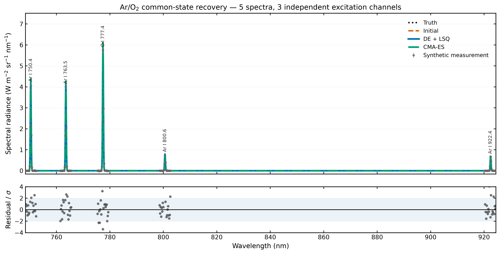
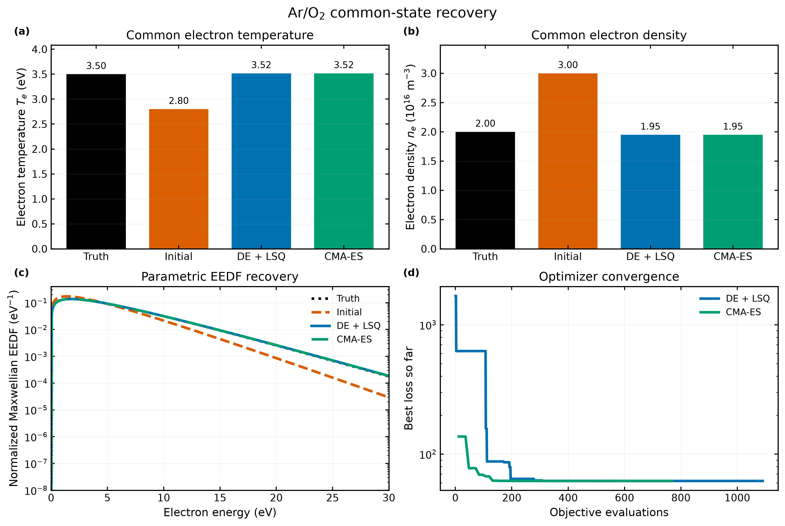
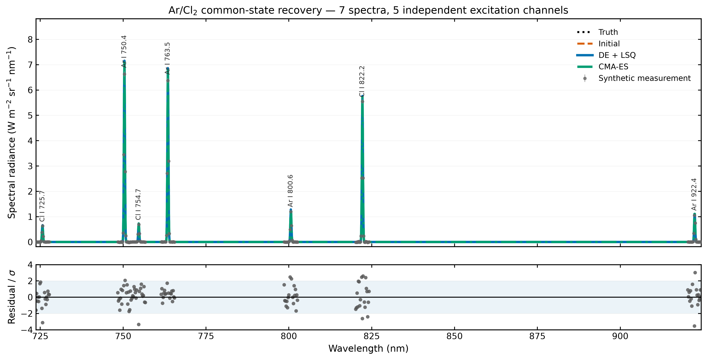
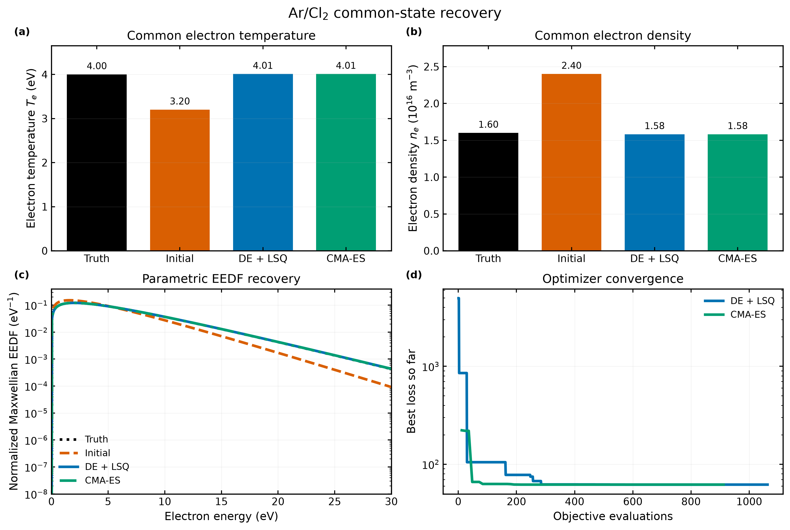

# Ar/O2・Ar/Cl2 共通電子状態ベンチマーク

## 結論

本検証では、同一プラズマ条件で得た複数の線分解スペクトルを同時に用い、全スペクトルに共通する電子温度 `Te` と電子密度 `ne` を推定した。既存の differential evolution + least-squares（DE + LSQ）と、独立実装の CMA-ES を同じ目的関数に適用した。判定はパラメータ誤差 5% 未満、測定データだけの局所ヤコビアンがフルランク、数値格子精密化差 1% 未満である。

これは**同じ前進モデルで生成・逆解析する自己整合性検証**であり、断面積や実プラズマに対する外部物理検証ではない。EEDF は自由関数として復元せず、推定 `Te` から定まる Maxwell EEDF の回収を評価する。

## 問題設定

| ケース | 観測スペクトル | 独立励起チャネル | 真値 `(Te, ne)` | 初期値 `(Te, ne)` |
|---|---:|---:|---:|---:|
| ar_o2 | 5 | 3 | (3.50 eV, 2.000e+16 m^-3) | (2.80 eV, 3.000e+16 m^-3) |
| ar_cl2 | 7 | 5 | (4.00 eV, 1.600e+16 m^-3) | (3.20 eV, 2.400e+16 m^-3) |

初期値は `Te` を真値より 20% 低く、`ne` を 50% 高く設定した。したがって初期スペクトルは真値と明確に異なるが、探索範囲端の非現実的な遠方点ではない。乱数 seed の変更比較は行わず、測定ノイズと CMA-ES にそれぞれ固定 seed を一つだけ用いた。

Ar/O2 は Ar I 750.4, 763.5, 800.6, 922.4 nm と O I 777.4 nm の5スペクトルを使う。ただし Ar の4線は2上準位からの分岐なので、独立励起情報は Ar 2 + O 1 = 3チャネルである。

Ar/Cl2 は上記 Ar 4線と Cl I 725.7, 754.7, 822.2 nm の7スペクトルを使い、独立励起情報は Ar 2 + Cl 3 = 5チャネルである。Cl 822.2 nm は Cl2 解離励起干渉チャネルとして分離した。

## 結果

| ケース | 手法 | Te 誤差 | ne 誤差 | EEDF L1 誤差 | スペクトル NRMSE | loss | 識別ランク | 格子精密化差 | 判定 |
|---|---|---:|---:|---:|---:|---:|---:|---:|---|
| ar_o2 | DE + LSQ | 0.51% | 2.55% | 0.47% | 1.27% | 61.93 | 2/2 | 0.07% | pass |
| ar_o2 | CMA-ES | 0.51% | 2.55% | 0.47% | 1.27% | 61.93 | 2/2 | 0.07% | pass |
| ar_cl2 | DE + LSQ | 0.25% | 1.15% | 0.23% | 1.01% | 61.92 | 2/2 | 0.06% | pass |
| ar_cl2 | CMA-ES | 0.25% | 1.15% | 0.23% | 1.01% | 61.92 | 2/2 | 0.06% | pass |

スペクトル NRMSE はノイズを含む測定値との差であり、ゼロを目標にしていない。EEDF L1 誤差は 0–30 eV で正規化 EEDF の絶対差を積分した値である。格子精密化差はエネルギー点数を 601→1201、波長内部格子を2倍にしたときの最大スペクトル相対 L2 差である。

## 図

スペクトル比較は個別線パネルではなく、全診断波長域を同一の物理波長軸・絶対放射輝度軸で重ねた。下段は各測定点の標準化残差で、淡青帯は ±2 sigma を示す。PNG に加えて学会原稿・ポスター編集用のベクター SVG も同じディレクトリへ出力する。



[Ar/O2 spectral fit (SVG)](common-state-figures/ar_o2_spectral_fit.svg)



[Ar/O2 recovery (SVG)](common-state-figures/ar_o2_recovery.svg)



[Ar/Cl2 spectral fit (SVG)](common-state-figures/ar_cl2_spectral_fit.svg)



[Ar/Cl2 recovery (SVG)](common-state-figures/ar_cl2_recovery.svg)

## 妥当性の解釈と限界

- 複数スペクトルを一つの `Te・ne` で同時説明でき、異なる最適化法が同じ解へ到達すれば、共通状態の連携計算と局所最適解依存の回避は確認できる。
- Ar の複数分岐線は観測点を増やすが、励起断面積の独立情報数を増やさない。本表では観測線数と独立チャネル数を分けた。
- Ar/O2 の O I 844.6 nm は現行モデルに断面積・上準位がないため追加していない。存在しない物理データを補間して線数を増やすことは避けた。
- Ar/Cl2 の3曲線は literature-anchored effective-emitter fit である。このケースは逆問題の有用性を検証するが、Cl 原子素過程の絶対精度を保証しない。外部測定または状態分解断面積による置換が次の物理検証である。
- `ne` の回収には絶対校正、視線長、Ar/O/Cl 密度が既知という前提がある。相対スペクトルだけの場合、`ne` と発光種密度・装置 gain は分離できない。

## 再実行

```powershell
.\.venv\Scripts\python.exe scripts\run_common_state_benchmarks.py
```

固定 seed: measurement=20261002, CMA-ES=20261002。seed sweep は実施しない。
