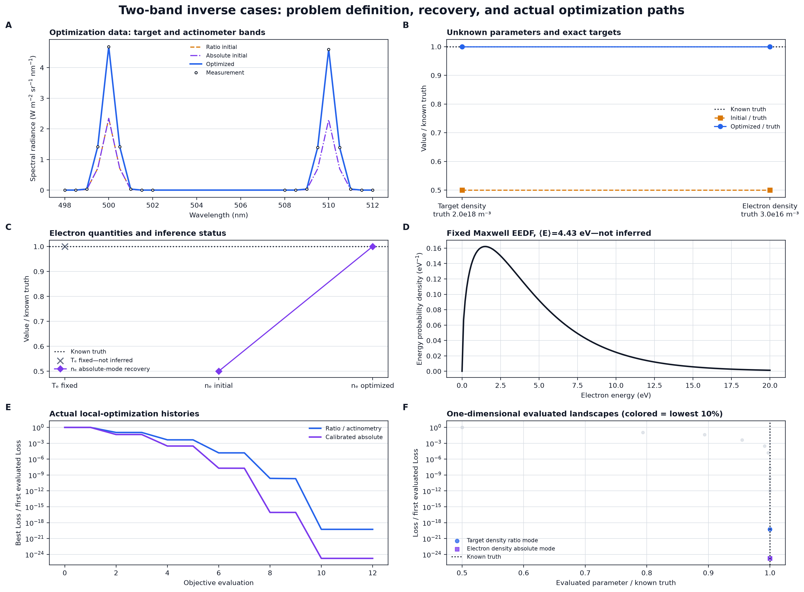
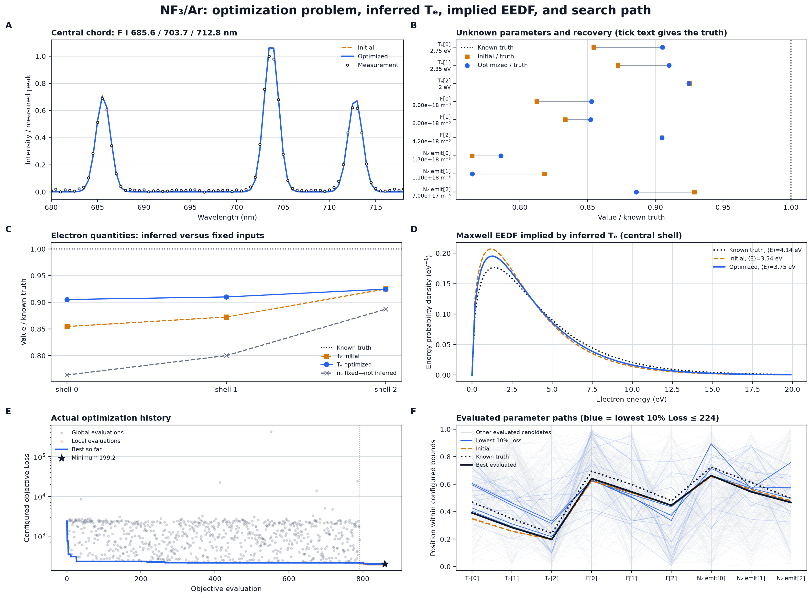
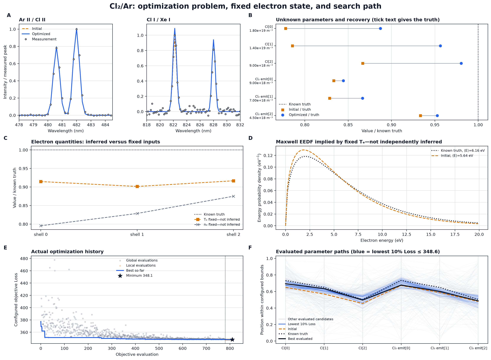

# OESCR 最適化問題・推定結果・探索履歴

`validation-figures` との役割の違い、各パネルの読み方、初期スペクトルが観測に近いことの妥当性評価は、[検証図・最適化図の読み方とベンチマーク妥当性](figure_interpretation_guide.md)にまとめている。遠方・非単調初期値、truth-near parameter prior なし、3 seed、held-out chord で再実行した結果は、[遠方初期値からの最適化頑健性ベンチマーク](optimization_robustness_benchmark.md)を参照すること。後者では NF3/Ar、Cl2/Ar とも version 2 の固定基準に不合格であり、本資料の旧ケースを頑健性の証拠として扱わない。

## 読み方と適用範囲

本資料は、各逆解析で何を観測として与え、何を未知パラメータとして最適化し、既知の生成真値をどこまで回収したかを可視化する。図中のスペクトルは観測、初期予測、最適化後予測を同一波長軸で比較する。Loss 履歴と並行座標は補間や疑似サンプルではなく、同じ乱数 seed と設定で再実行した目的関数の実評価点である。

並行座標では、各パラメータを設定 bounds 内の位置へ正規化している。薄灰はその他の評価候補、青は Loss 下位 10%、黒実線は最良評価点、黒点線は生成真値、橙破線は初期値である。異なるケースの Loss は残差数・重み・事前分布が異なるため、ケース間で絶対値を比較しない。

EEDF は自由形状を推定した結果ではない。`plasma_mode: te` と Maxwell 仮定の下で、推定または固定された電子温度から導出した分布である。したがって「EEDF が一致した」は、その Maxwell モデル内での一致を意味する。

## 1. 二バンド最小逆解析



### 問題設定

- 観測: 498–512 nm、18点の絶対分光放射輝度。500 nm に対象種、510 nm にactinometerのGaussianバンドを持つ。
- ratio / actinometry: 2窓の積分面積比から対象種密度1変数を推定する。actinometryは同じ数値残差に物理仮定を加えた用途である。
- calibrated absolute: 校正済み全スペクトルから電子密度1変数を推定する。
- 電子温度 `3.0 eV` と Maxwell EEDF は固定入力であり、推定対象ではない。

### 正解値と結果

| モード | 未知量 | 初期値 | 正解値 | 最適化結果 |
|---|---|---:|---:|---:|
| ratio / actinometry | Target密度 | `1.0e18 m-3` | `2.0e18 m-3` | `1.9999999997e18 m-3` |
| calibrated absolute | 電子密度 | `1.5e16 m-3` | `3.0e16 m-3` | `3.0000000000e16 m-3` |

両モードで初期スペクトルの振幅差が解消し、生成真値を数値許容内で回収した。Loss履歴は単調なbest-so-far低下を示す。1変数問題で並行座標を使う意味がないため、パネルFは実評価点の1次元Loss地形としている。

## 2. NF3/Ar 生成ベンチマーク



### 問題設定

- 観測: 300–820 nm、5 chordの生成スペクトル。図Aは中央chordの情報量が高い F I 685.6、703.7、712.8 nm領域を示す。
- 未知量: 3 shellの電子温度、F密度、N2発光プロキシ密度の計9変数。
- 電子密度はrelative-shape観測と自動gainの縮退を避けるため固定されており、推定していない。
- global differential evolutionの後にlocal least-squaresを行う。記録はglobal 792、local 70、final 1の計863評価である。

### 正解値と結果

| 量 | 正解値 | 最適化結果 | 相対差 |
|---|---|---|---|
| `Te[0:3]` | `[2.75, 2.35, 2.00] eV` | `[2.489, 2.139, 1.849] eV` | `-9.5, -9.0, -7.5%` |
| `F[0:3]` | `[8.0, 6.0, 4.2]e18 m-3` | `[6.822, 5.113, 3.800]e18 m-3` | `-14.7, -14.8, -9.5%` |
| `N2_emit[0:3]` | `[1.7, 1.1, 0.7]e18 m-3` | `[1.336, 0.841, 0.620]e18 m-3` | `-21.4, -23.5, -11.4%` |
| 固定 `ne[0:3]` | `[11.0, 8.5, 6.2]e15 m-3` | `[8.4, 6.8, 5.5]e15 m-3` | 推定対象外 |

中心shellのMaxwell EEDFは、正解平均エネルギー `4.142 eV` に対して最適化後 `3.752 eV` である。正規化EEDFの真値に対する積分絶対差は初期 `0.1450` から `0.0919` へ改善した。ただし、これは推定 `Te` から導出した結果であり独立なEEDF逆解析ではない。

最小Lossは `199.242`、Loss下位10%の境界は `223.984` である。並行座標では低Loss候補が複数の `Te–F` 組合せへ広がり、最良点も生成真値からずれる。条件数 `3.15e6` と整合する悪条件性であり、F Iスペクトルの一致だけから9変数を高精度回収できたとは判断しない。

## 3. Cl2/Ar 生成ベンチマーク



### 問題設定

- 観測: 300–832 nm、5 chordの生成スペクトル。図Aは中央chordの Ar II/Cl II 二重線と Cl I/Xe I領域を示す。
- 未知量: 3 shellのCl密度とCl2発光プロキシ密度の計6変数。
- 電子温度、電子密度、Maxwell EEDFは固定入力であり、最適化していない。
- global differential evolutionの後にlocal least-squaresを行う。記録はglobal 780、local 35、final 1の計816評価である。

### 正解値と結果

| 量 | 正解値 | 最適化結果 | 相対差 |
|---|---|---|---|
| `Cl[0:3]` | `[18.0, 14.0, 9.0]e18 m-3` | `[15.970, 13.388, 8.823]e18 m-3` | `-11.3, -4.4, -2.0%` |
| `Cl2_emit[0:3]` | `[9.0, 7.0, 4.5]e18 m-3` | `[7.599, 6.065, 4.288]e18 m-3` | `-15.6, -13.4, -4.7%` |
| 固定 `Te[0:3]` | `[4.10, 3.55, 3.00] eV` | `[3.75, 3.20, 2.75] eV` | 推定対象外 |
| 固定 `ne[0:3]` | `[22.0, 17.5, 12.0]e15 m-3` | `[17.5, 14.5, 10.5]e15 m-3` | 推定対象外 |

中心shellのEEDFは固定 `Te` から導出されるため最適化前後で変化しない。正解平均エネルギー `6.164 eV` に対して固定入力は `5.640 eV`、正規化EEDFの積分絶対差は `0.0825` である。このケースはCl系密度を推定する試験であり、電子温度、電子密度、EEDFの予測試験ではない。

最小Lossは `348.088`、Loss下位10%の境界は `348.552` である。低Loss経路は最良点周辺へ比較的集中し、条件数 `59.5` と整合してNF3/Arより局所的に安定している。ただしCl2発光プロキシの内側shellには13–16%の過小推定が残る。

## 再生成

Loss履歴を必要な実行だけで記録するため、通常の逆解析では履歴を保存しない。診断時は次のように明示する。

```powershell
.venv/Scripts/python.exe scripts/run_inverse.py examples/benchmarks/nf3_ar_ccp_clean_2023/case_init.yaml examples/benchmarks/nf3_ar_ccp_clean_2023/inverse.yaml --record-trace --out .local_outputs/optimization_diagnostics/nf3
.venv/Scripts/python.exe scripts/run_inverse.py examples/benchmarks/cl2_ar_icp_fuller2001/case_init.yaml examples/benchmarks/cl2_ar_icp_fuller2001/inverse.yaml --record-trace --out .local_outputs/optimization_diagnostics/cl2
.venv/Scripts/python.exe scripts/generate_optimization_diagnostic_figures.py
```

全パラメータの初期値、正解値、最適化値、相対差は [parameter_recovery.csv](optimization-figures/parameter_recovery.csv) に保存している。
