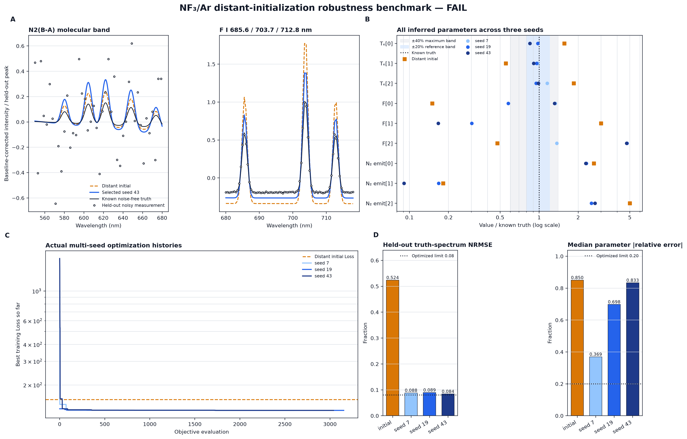
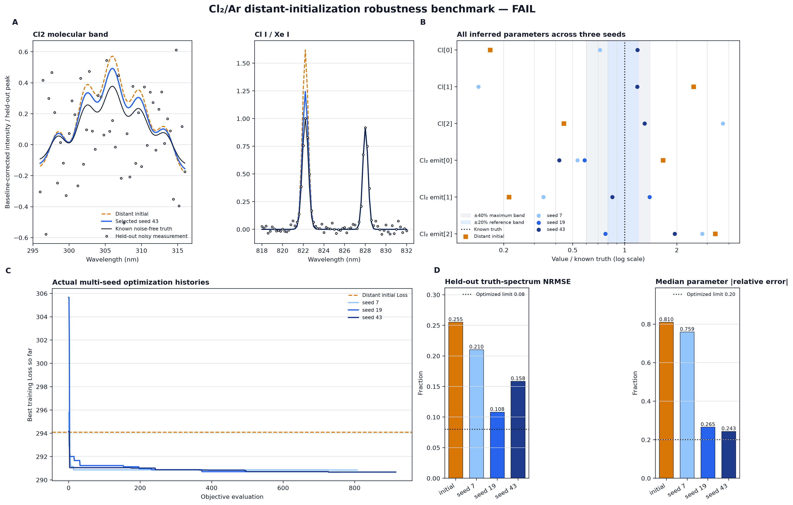

# 遠方初期値からの最適化頑健性ベンチマーク

実施日: 2026-10-01

対象: NF3/Ar CCP、Cl2/Ar ICP の生成自己整合性ケース

## 結論

従来の `optimization-figures` は、生成真値に比較的近い初期値と真値近傍のパラメータ prior を含む workflow 回帰試験であり、広い初期条件からの頑健性を証明する設定ではなかった。この問題を分離するため、次の条件を versioned 設定として固定した別ベンチマークを追加して再実行した。

- 真値から遠く、shell 間で非単調な初期分布を使用する。
- 真値近傍の Te・F・N2 発光プロキシ・Cl・Cl2 発光プロキシ prior を除外する。
- chord 0–3 だけを最適化に使用し、chord 4 は最適化後まで未使用とする。
- differential evolution と局所 least-squares を seed 7、19、43 で独立に実行する。
- 最良 run は **training objective 最小**だけで選び、真値誤差と held-out chord は選択に使わない。
- 初期値の難しさと最適化後の合格条件を version 2 の `robustness.yaml` に固定する。

この条件では **NF3/Ar、Cl2/Ar とも不合格**であった。初期スペクトルを意図的に難しくした条件でも Loss 自体は収束したが、未知パラメータ回収と未使用 chord の予測は合格基準に達しなかった。したがって現時点の正確な結論は次のとおりである。

> 現行の自由な shell 別パラメータ化では、同一モデル生成データに対しても、遠方初期値から一意かつ再現よく真値へ戻るとはいえない。特に NF3/Ar の F・N2 発光プロキシ分布は非同定性が強い。Loss の収束だけを物理量推定の成功とみなしてはならない。

これは外部実験による物理妥当性試験ではない。同じ OESCR forward model で生成・逆解析したデータに限定した、optimizer とパラメータ同定性の内部頑健性試験である。

## 1. 問題設定

### 1.1 変更前のベンチマークとの役割分離

| ベンチマーク | 目的 | 初期値・prior | データ分割 | 主張できること |
|---|---|---|---|---|
| 従来の `optimization-figures` | workflow 回帰、目的関数・探索履歴の可視化 | 真値に比較的近い初期値、パラメータ prior あり | 5 chord を fitting | 既知設定付近で計算経路が動作する |
| 本 robustness benchmark | 遠方初期値からの回収、seed 再現性、空間外挿 | 遠方・非単調初期値、真値近傍 parameter prior なし | chord 0–3 を fitting、chord 4 を held-out | 現行パラメータ化が初期値に頑健か |
| 外部物理 benchmark | 実験に対するモデル妥当性 | 独立に閉じた入力と不確かさ | 外部 evaluator と held-out 実験 | 宣言した範囲の物理精度 |

旧ケースは削除せず回帰 baseline として保持する。ただし旧ケースの成功を optimizer robustness の証拠には使わない。

### 1.2 共通する最適化手順

各 seed で同じ遠方初期値から、global differential evolution（`maxiter=18`, `popsize=10`）と local least-squares（`max_nfev=220`）を実行した。探索 bounds と目的関数は既存ケースと同じで、パラメータ prior だけを空にした。NF3/Ar の Te 二階差分、Cl2/Ar の Cl 二階差分という弱い smoothness regularization は、プロファイルの物理的連続性に対する既存規則として保持した。instrument 共通の gain/offset は chord 0–3 だけから推定し、その値を chord 4 の予測へそのまま適用した。

ここで `held-out chord` は「今回の robustness 最適化の残差へ入れていない」という内部データ分割を意味する。固定 fixture 自体は既存 workflow benchmark で使用歴があり、外部の未見実験データという意味ではない。

最適化 Loss は、学習スペクトル残差、window の面積・peak、instrument nuisance 項、smoothness 項を含む既存目的関数

\[
L(\boldsymbol{\theta}) = \frac{1}{2}\,\|\boldsymbol{r}_{\mathrm{train}}(\boldsymbol{\theta})\|_2^2
\]

である。図 A の白丸は noisy held-out measurement だが、pointwise noise が大きい broad band を不当に失格にしないため、合否指標は versioned `forward_truth/` に保存された **noise-free 生成 spectrum** と候補 spectrum を比較する。両者から各 window の local linear baseline を別々に除き、noise-free truth の peak で正規化した

\[
\mathrm{NRMSE}_w =
\sqrt{\frac{1}{N_w}\sum_{i\in w}
\left(\frac{\hat y_i-y_i^\ast}{\max_{j\in w}|y_j^\ast|}\right)^2}
\]

とした。ここで \(y^\ast\) は held-out chord の noise-free 生成真値、\(\hat y\) は初期値または最適化値からの予測である。各 window の NRMSE を等重み平均した。表示用の noisy measurement と合否用 truth spectrum を分離したため、measurement noise をモデル誤差として罰せず、同時に実際に optimizer が受け取ったデータも図から隠さない。パラメータ回収誤差は

\[
e_j = \left|\frac{\hat\theta_j}{\theta_j^\ast}-1\right|
\]

の median と maximum で評価した。

### 1.3 version 2 で固定した合格条件

| 項目 | 条件 | 意味 |
|---|---:|---|
| 初期 median parameter error | 0.40 以上 | 初期値が真値近傍でない |
| 初期 held-out truth-spectrum NRMSE | 0.15 以上 | 初期スペクトルが最初から生成真値へ一致していない |
| 最適化後 held-out truth-spectrum NRMSE | 0.08 以下 | 未使用 chord の noise-free spectrum を予測できる |
| 最適化後 median parameter error | 0.20 以下 | fitted parameter の半数以上が概ね ±20% 内 |
| 最適化後 maximum parameter error | 0.40 以下 | 一部パラメータだけが大きく破綻していない |
| seed 合格率 | 2/3 以上 | 一つの偶然な seed に依存しない |

初期条件の二つを満たし、かつ各 seed の三つの最適化後条件を満たす run が 2/3 以上である場合だけ全体を PASS とする。

最初の作図確認では noisy measurement に対する pointwise NRMSE を用い、Cl2/Ar の固定 `Ar_plus`/`Cl_plus` 成分も平均へ含めていた。しかし、その定義では noise floor の高い molecular band は生成真値そのものでも低い NRMSE に到達できず、逆に fitted parameter に依存しない window が平均誤差を人工的に下げる。この評価器の問題を結果として扱わず、最適化 run は一切やり直さずに、(1) 合否を noise-free truth spectrum 比較へ変更、(2) NF3/Ar に N2(B-A) band を追加、(3) Cl2/Ar から固定 Ar II/Cl II window を除外した。設定 version を 2 へ上げ、派生する CSV、YAML、図、本文を同時更新した。これは optimizer の成績を良くする変更ではなく、合否指標の物理的意味を閉じる変更である。

## 2. NF3/Ar



### 2.1 初期値と未知パラメータ

電子密度は relative-shape と自動 gain の絶対 scale 縮退を避けるため、生成真値に固定した。未知量は 3 shell の電子温度、F 密度、N2 発光プロキシ密度の 9 変数である。Maxwell EEDF は推定 Te から導出されるため、自由形状 EEDF の推定ではない。

| 量 | 遠方初期値 | 生成真値 | bounds |
|---|---|---|---|
| `Te[0:3]` (eV) | `[4.30, 1.30, 3.70]` | `[2.75, 2.35, 2.00]` | `[1.2, 4.5]` |
| `F[0:3]` (m-3) | `[1.2e18, 1.8e19, 2.0e18]` | `[8.0e18, 6.0e18, 4.2e18]` | `[1.0e18, 2.0e19]` |
| `N2_emit[0:3]` (m-3) | `[4.5e18, 2.0e17, 3.5e18]` | `[1.7e18, 1.1e18, 0.7e18]` | `[1.0e17, 5.0e18]` |

初期 median parameter error は `0.850`、held-out truth-spectrum NRMSE は `0.524` で、難しい初期条件としての二条件を満たした。

### 2.2 結果

| seed | training Loss | held-out truth NRMSE | median parameter error | maximum parameter error | 合否 |
|---:|---:|---:|---:|---:|---|
| 7 | 129.363447 | 0.088 | 0.369 | 1.696 | FAIL |
| 19 | 129.364645 | 0.089 | 0.698 | 3.762 | FAIL |
| 43 | **129.362690** | **0.084** | 0.833 | 3.730 | FAIL |

training Loss 最小の seed 43 が規則により選択された。初期 Loss `155.829701` から `129.362690` へ約 17.0% 低下した一方、seed 43 の held-out truth-spectrum NRMSE は `0.084` と閾値 `0.08` をわずかに超え、median parameter error は `0.833` で大幅に不合格である。3 seed の合格率は `0/3` である。

図 A は fitting に使わなかった chord 4 の N2(B-A) band と F I 685.6、703.7、712.8 nm を示す。遠方初期値の window 別 truth-spectrum NRMSE は N2 `0.542`、F I `0.505` であり、選択 seed 43 ではそれぞれ `0.123`、`0.045` へ改善した。図 B では Te は概ね真値付近へ移動する一方、F と N2 発光プロキシは seed ごとに異なる低 Loss 解へ分岐する。選択 seed 43 では Te の絶対相対誤差は `1.3–15.2%` だが、F[2] は真値の `4.73` 倍、N2_emit[1] は `0.091` 倍である。

seed 間の training Loss 差は最大でも約 `0.00196` しかないのに、median parameter error は `0.369–0.833` へ広がる。training objective が物理真値を一意に順位付けできないことを直接示す。

### 2.3 評価

NF3/Ar は **探索が数値的に収束しても、F と N2 発光プロキシの shell 分布が同定できない**。Te から導出される Maxwell EEDF は Te 回収範囲内では改善するが、これは自由 EEDF の検証ではなく、密度分布の非同定性も解消しない。次の改良は反復回数の追加や truth-near prior の復元ではなく、観測が区別できる低次元 profile basis または可観測な密度組合せへ fitted parameter を減らすことである。

## 3. Cl2/Ar



### 3.1 初期値と未知パラメータ

このケースの未知量は 3 shell の Cl 密度と Cl2 発光プロキシ密度の 6 変数である。電子温度、電子密度、Maxwell EEDF は固定入力であり、このベンチマークで予測・検証した量ではない。

| 量 | 遠方初期値 | 生成真値 | bounds |
|---|---|---|---|
| `Cl[0:3]` (m-3) | `[3.0e18, 3.5e19, 4.0e18]` | `[1.8e19, 1.4e19, 9.0e18]` | `[2.0e18, 4.0e19]` |
| `Cl2_emit[0:3]` (m-3) | `[1.5e19, 1.5e18, 1.5e19]` | `[9.0e18, 7.0e18, 4.5e18]` | `[1.0e18, 2.0e19]` |

初期 median parameter error は `0.810`、held-out truth-spectrum NRMSE は `0.255` で、難しい初期条件としての二条件を満たした。

### 3.2 結果

| seed | training Loss | held-out truth NRMSE | median parameter error | maximum parameter error | 合否 |
|---:|---:|---:|---:|---:|---|
| 7 | 290.846278 | 0.210 | 0.759 | 2.692 | FAIL |
| 19 | 290.671563 | **0.108** | 0.265 | **0.414** | FAIL |
| 43 | **290.671468** | 0.158 | **0.243** | 0.943 | FAIL |

初期 Loss `294.106485` から、選択 seed 43 の `290.671468` へ約 1.17% 低下した。3 seed の合格率は `0/3` である。seed 19 は maximum parameter error `0.414` まで近づいたが、`0.40` の基準を超え、held-out truth-spectrum NRMSE も `0.108` で `0.08` を満たさない。

held-out window 別 truth-spectrum NRMSE は次のとおりである。

| window | 初期 | seed 7 | seed 19 | seed 43（選択） |
|---|---:|---:|---:|---:|
| Cl2 molecular band | 0.349 | 0.269 | **0.140** | 0.234 |
| Cl I / Xe I | 0.161 | 0.152 | **0.076** | 0.083 |

固定 `Ar_plus` と `Cl_plus` だけで決まる Ar II/Cl II window は、fitted Cl/Cl2 の頑健性を評価しないため version 2 の合否・図から外した。選択 seed 43 は Cl I/Xe I を `0.083` まで改善するが、Cl2 molecular band が `0.234` に残り、seed 19 より training Loss が `0.000095` 小さいだけで truth-spectrum 予測は悪い。最小 training Loss と最良の未使用空間予測が一致しない。

### 3.3 評価

Cl2/Ar は NF3/Ar より改善し、seed 19 では全パラメータが概ね ±42% 内まで回収された。しかし最低 training Loss の seed 43 は最大誤差 `0.943` であり、低 Loss 解の間で shell 分布が一意でない。まず Cl と Cl2 発光プロキシの profile 自由度を、観測 chord が識別可能な少数係数へ落とし、同じ blind selection と held-out chord で再試験する必要がある。

## 4. 図の読み方

- **A: held-out spectrum** — 白丸が未使用 chord の noisy 生成測定、黒線が noise-free 生成真値、橙破線が遠方初期値、青線が training Loss だけで選択した run である。合否 NRMSE は橙/青と黒の比較で計算し、白丸は optimizer が受け取った noise level を示す。
- **B: parameter / truth** — 黒点線 `1` が生成真値、青帯が ±20%、灰帯が ±40%、橙四角が初期値、青丸が各 seed の最適化値である。seed 間の横方向の広がりは同じ観測を説明する解の非一意性を示す。
- **C: best-so-far Loss** — 実際に評価した点の累積最小値である。下降は数値探索の進行を示すが、真値回収を保証しない。
- **D: acceptance metrics** — 点線より低いことが最適化後の必要条件である。初期棒は「十分難しい初期値だったか」の確認用であり、最適化後閾値との合否には使わない。

図中の `FAIL` は version 2 で固定した三つの run 条件と seed 合格率に対する判定であり、ソルバーが例外終了したという意味ではない。

## 5. 設計判断と次の実装

この結果を受け、計画上の次段階を「探索回数を増やして見かけ上の成功例を探す」ことから、**観測可能な低次元パラメータ化を設計し、同一 protocol で反証可能に再試験する**ことへ更新する。

1. measurement-only Jacobian と低 Loss run の分散から、識別不能な shell 方向を特定する。
2. NF3/Ar は F・N2発光プロキシ、Cl2/Ar は Cl・Cl2発光プロキシを、固定 shape × scale、中心/端の二係数、または物理的に説明可能な少数 basis の候補で比較する。
3. fitted parameter が実際に観測を変えることを既存 identifiability gate で確認する。
4. 本ファイルの初期値、seed、データ分割、合格条件、blind selection を変更せず再実行する。
5. 内部生成 benchmark が PASS した後も、外部実験 benchmark は別 evaluator として扱い、内部 PASS を外部物理精度へ読み替えない。

truth-near prior の復元、held-out chord を fitting に戻す、結果を見て seed や閾値を選び直す変更は採用しない。

## 6. 再現方法と証拠

```bash
python scripts/run_optimization_robustness_benchmarks.py
python scripts/generate_robustness_benchmark_figures.py
pytest tests/test_robustness_benchmark.py
```

| 内容 | ファイル |
|---|---|
| NF3/Ar 初期値・逆解析・判定規則 | [`case_robust_init.yaml`](../examples/benchmarks/nf3_ar_ccp_clean_2023/case_robust_init.yaml)、[`inverse_robust.yaml`](../examples/benchmarks/nf3_ar_ccp_clean_2023/inverse_robust.yaml)、[`robustness.yaml`](../examples/benchmarks/nf3_ar_ccp_clean_2023/robustness.yaml) |
| Cl2/Ar 初期値・逆解析・判定規則 | [`case_robust_init.yaml`](../examples/benchmarks/cl2_ar_icp_fuller2001/case_robust_init.yaml)、[`inverse_robust.yaml`](../examples/benchmarks/cl2_ar_icp_fuller2001/inverse_robust.yaml)、[`robustness.yaml`](../examples/benchmarks/cl2_ar_icp_fuller2001/robustness.yaml) |
| 実行コード | [`run_optimization_robustness_benchmarks.py`](../scripts/run_optimization_robustness_benchmarks.py) |
| 評価・作図コード | [`generate_robustness_benchmark_figures.py`](../scripts/generate_robustness_benchmark_figures.py) |
| 全 run 要約 | [`robustness_summary.csv`](robustness-figures/robustness_summary.csv)、[`robustness_summary.yaml`](robustness-figures/robustness_summary.yaml) |
| parameter 回収値 | [`parameter_recovery.csv`](robustness-figures/parameter_recovery.csv) |
| window 別 held-out 指標 | [`held_out_window_metrics.csv`](robustness-figures/held_out_window_metrics.csv) |

各最適化の完全な trace と `x_opt` は `.local_outputs/robustness_benchmarks/` に保存するが、再生成可能なローカル出力として Git 管理しない。公開証拠は設定、生成コード、図、CSV、YAML で固定する。
