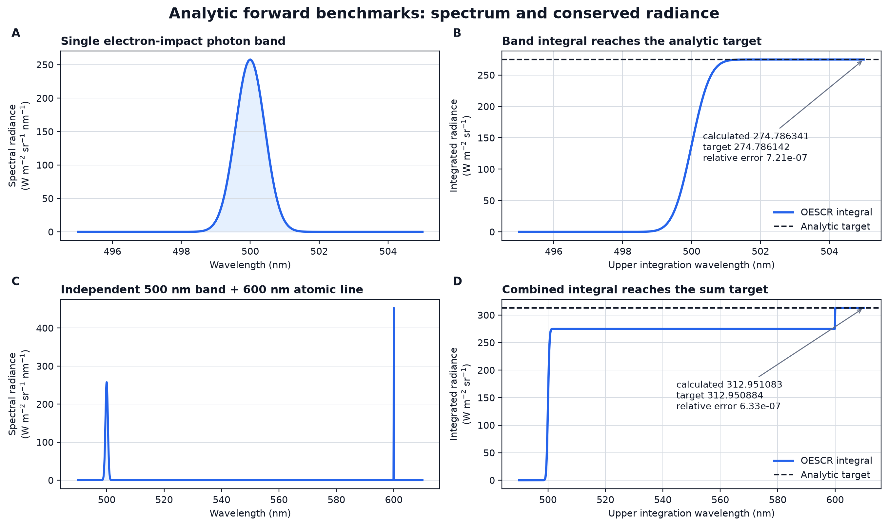
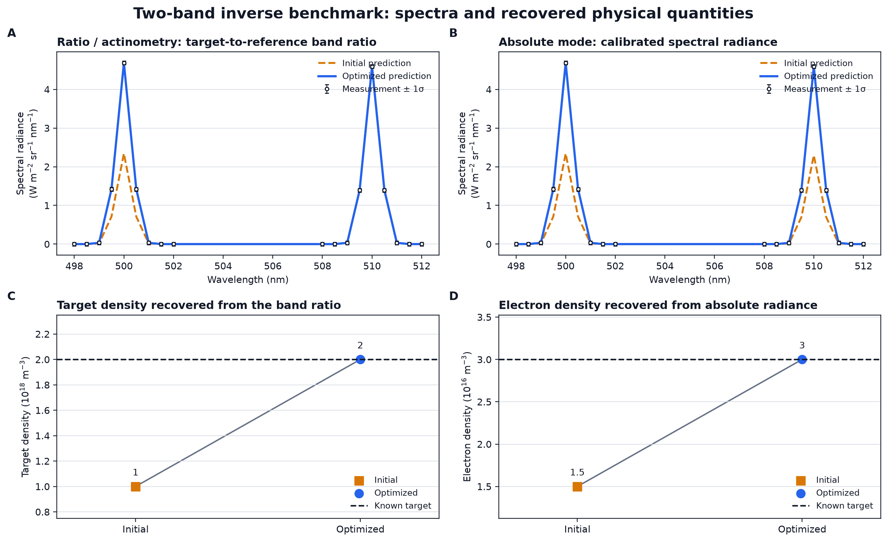
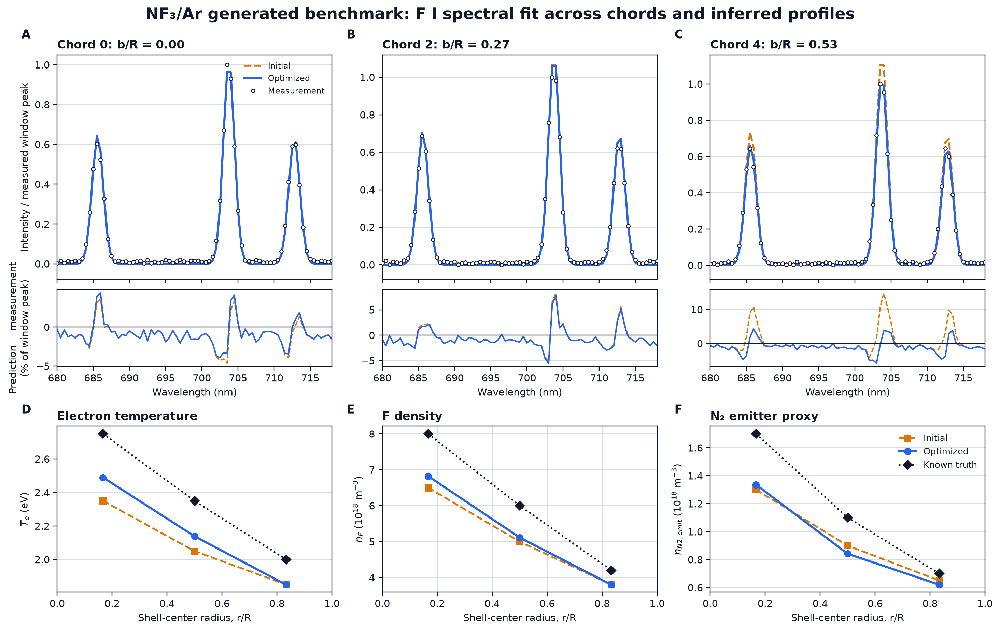
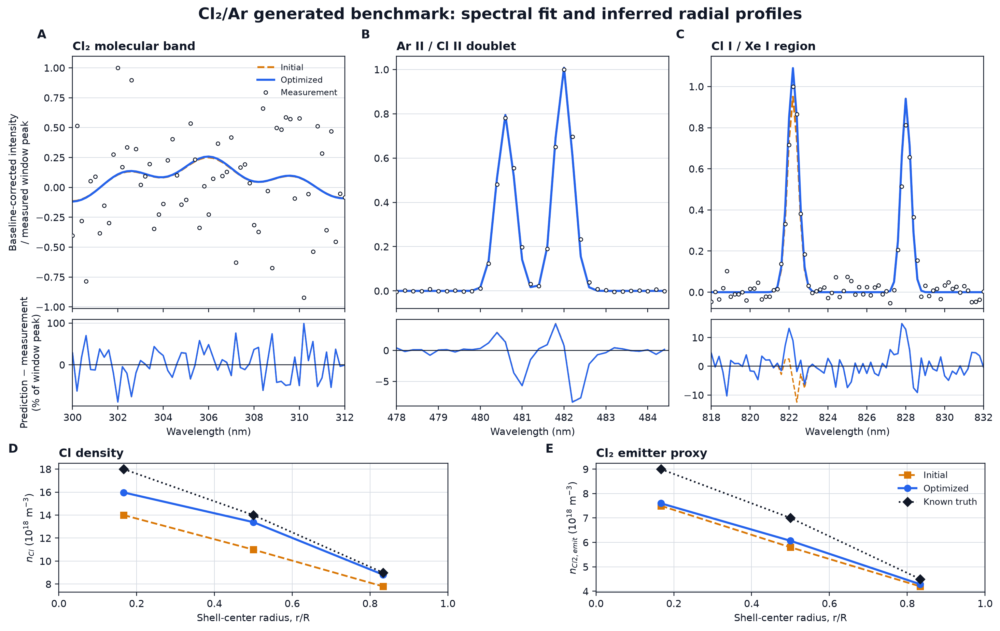

# OESCR 科学的検証報告書

静的図版は `validation-figures/`、再生成スクリプトは `scripts/generate_validation_figures.py` に置いている。図はスコアだけでなく、観測スペクトル、初期予測、最適化後予測、波長ごとの残差、および既知真値に対する推定プロファイルを直接比較する。生成データ上の一致は外部実験に対する精度を意味しない。

**版:** 2026-09-30

**対象:** OESCR v0.1.0 の定常・縮約 collisional-radiative（CR）計算、発光・観測計算、逆解析、および外部データ比較
**判定:** 数理実装と生成データ上の自己整合性は確認済み。外部実験に対する定量的な物理モデル妥当性は未認定。

## 検証図版



*図 1. 電子衝突光子バンド、および同バンドと原子線を結合した解析ベンチマーク。左列は OESCR が計算した分光放射輝度、右列は波長上限までの累積積分である。破線は入力から独立に求めた解析目標値であり、最終積分値は相対差 `7.21e-7` および `6.33e-7` で一致した。*



*図 2. 二バンド最小逆解析。上段は生成観測と初期・最適化後スペクトルの直接比較、下段は推定対象と既知真値の比較である。ratio と actinometry は同じ比残差の数値経路を通り、対象種密度 `2.0e18 m-3` を回収する。calibrated absolute は全スペクトルと絶対校正を用い、電子密度 `3.0e16 m-3` を回収する。*



*図 3. NF3/Ar 生成ベンチマーク。上段は中心、中央、外側 chord における情報量の高い F I 685.6、703.7、712.8 nm 領域、中央段は各波長の観測残差、下段は 3 shell の電子温度、F 密度、N2 発光プロキシである。青線は橙線より観測へ近づくが、既知真値を完全には回収しない。特に NF3/Ar は悪条件であり、この図は外部物理精度を示さない。*



*図 4. Cl2/Ar 生成ベンチマーク中央 chord。上段は局所ベースラインを除いた Cl2 306 nm 帯、Ar II/Cl II 二重線、Cl I/Xe I 領域、中央段は波長別残差、下段は Cl および Cl2 発光プロキシの 3 shell 分布である。イオン二重線と中性線領域は形状を再現する一方、306 nm 帯はノイズに対して弱く、推定値と既知真値の差が残る。*

最適化の問題設定、未知パラメータと生成真値、電子温度・電子密度・EEDF の推定可否、実際の Loss 履歴、および低 Loss 候補の並行座標は [optimization_diagnostics.md](optimization_diagnostics.md) に分離した。これにより、固定入力を推定結果と誤認せずに各ケースを監査できる。

## 要旨

本報告書は、OESCR に対して実施した科学的検証を、問題設定、使用データ、検証方法、結果、考察の順に整理する。検証は、(1) 閉形式解と保存則による数理実装の検証、(2) 物理量の単位・積分・観測変換の検証、(3) 生成データを用いた逆解析の自己整合性検証、(4) 文献・NIST・LXCat に基づく外部データ評価、の四層に分けた。

二準位および三準位 CR 系では、状態密度、遷移ごとの光子生成率、放射分岐、状態別収支が閉形式解と一致した。物理バンドおよび原子線を結合した前向き計算では、体積放射、視線積分、装置出力の保存誤差は `7.3e-7` 未満であり、規定許容値 `2.0e-4` を十分下回った。三つの最小逆解析では、線比から対象種密度 `2.0e18 m-3`、絶対分光放射輝度から電子密度 `3.0e16 m-3` を相対誤差 `1e-6` 未満で回収した。NF3/Ar および Cl2/Ar の生成スペクトルでは厳格ゲートを通過したが、NF3/Ar は条件数 `3.15e6` と強く悪条件であり、Cl2/Ar を含め両者は経験的発光成分と生成観測を使用するため、実験的精度の証拠ではない。

外部候補として、Schuecke et al. の N2/O2 絶対 UV 光子生成率と、Arellano et al. の Ar `I(763.5 nm)/I(750.4 nm)` 比を整備した。前者は主励起源 N2(A) 密度が独立に閉じておらず比較未実施である。後者では、NIST の全放射分岐、Chilton の絶対断面積アンカー、ユーザーが取得した LXCat BSR-500 および NGFSRDW 曲線を使用した。BSR の予測比範囲 `0.585–1.202` は低圧実測 `0.584–0.697` と重なる一方、NGFSRDW の `0.115–0.321` は重ならず、同一条件で両モデルは `3.68–5.09` 倍異なった。この差は、現段階の不確かさモデルより大きい主要なモデル差である。したがって BSR の重なりだけを「検証合格」と解釈できない。

今回の Ar 評価器は実行ファイルとしては `scripts/` に分離され、OESCR の実行時パッケージにも組み込まれていない。しかし EEDF と速度係数積分に OESCR の数値核を再利用しているため、独立外部ソルバーによる相互検証ではない。本報告書ではこれを **診断的感度評価** と明記し、外部物理ベンチマークの完了条件を、OESCR 内部物理モジュールを import しないブラックボックス比較、独立 EEDF または独立ソルバー、固定された不確かさと合否基準、と定義する。

## 1. 目的と検証上の問い

OESCR の目的は、グローバルプラズマモデルを内包することではなく、利用者が明示した電子状態、組成、反応、原子・分子データ、幾何、装置応答の条件下で、縮約 CR・発光・観測・逆解析を一貫して実行する基盤を提供することである。したがって本検証で問う事項は次の五点である。

1. CR 行列、速度係数、放射分岐、発光、視線積分、装置変換が数式どおり実装されているか。
2. 原子線、物理バンド、複数成分の和が、光子数または放射パワーの保存則を満たすか。
3. 観測が情報を持つ場合に逆解析が既知真値を回収し、情報を持たない場合にランク欠損や縮退を隠さないか。
4. 外部実験および外部原子データと比較したとき、どの物理要因が予測を支配し、どこまで妥当性を主張できるか。
5. 検証データへの調整と独立評価を分離し、自己整合性を外部妥当性と誤認しない証拠管理になっているか。

本報告書の対象外は、自己無撞着な組成計算、電力収支、輸送、電子ボルツマン方程式、任意 EEDF の一意再構成である。これらを追加して外部データへ強制的に一致させることは、本検証の目的ではない。モデル境界の正式な定義は [capability_matrix.md](capability_matrix.md) にある。

## 2. 用語と証拠階層

本報告書では、以下を区別する。

| 区分 | 問い | 合格が意味すること | 合格しても意味しないこと |
|---|---|---|---|
| 数理検証（verification） | 方程式を正しく解いているか | 実装が閉形式解・保存則・単位契約に一致 | 方程式自体が実験を表すこと |
| 数値適格性 | 離散化と線形代数が安定か | 選択した格子・条件で数値誤差が管理される | 原子データや欠落機構の正しさ |
| 生成データ自己整合性 | 同じモデルで作った観測を回収できるか | 前向き・逆向きのデータ経路が整合 | 未知の実験に対する予測精度 |
| 外部比較 | 独立データと一致するか | 条件と不確かさが閉じた範囲の妥当性 | 他ガス、他圧力、他装置への普遍性 |
| 外部定量認定 | held-out データ、閉じた入力、固定公差を満たすか | 宣言した量・範囲で定量精度を主張可能 | OESCR 全体または全用途の妥当性 |

現在の到達点は、数理検証、数値適格性、生成データ自己整合性までが合格である。外部データは二候補を整備し、Ar について診断的比較まで実施したが、外部定量認定には達していない。

## 3. 共通する理論・評価方法

### 3.1 定常 CR 系

解く状態密度ベクトルを \(\mathbf{n}\)、外部供給源を \(\mathbf{b}\)、放射・衝突・壁損失および状態間移送を含む行列を \(\mathbf{M}\) とすると、OESCR の縮約定常系は

\[
\mathbf{M}\mathbf{n}=\mathbf{b}
\]

である。検証では解だけでなく、相対残差、行列ランク、状態ごとの総流入・総流出、正味収支を評価する。これにより、同じ誤りが行列と期待値の双方へ混入して見かけ上一致する危険を減らしている。

### 3.2 電子衝突速度係数

エネルギー確率密度 \(f_E(E)\) を \(\int f_E(E)dE=1\) と正規化し、断面積 \(\sigma(E)\)、電子速度 \(v(E)=\sqrt{2eE/m_e}\) を用いて

\[
k=\int \sigma(E)v(E)f_E(E)\,dE
\]

を計算する。断面積は宣言したしきい値未満および表の支持範囲外でゼロとし、補間はエネルギーに対する線形補間とした。Maxwell 型と Druyvesteyn 型の比較では、公平性のため平均エネルギーを一致させた。

### 3.3 発光と観測

原子線 \(u\rightarrow l\) の積分体積放射輝度は、光学的に薄い場合、

\[
\varepsilon_{ul}=\frac{n_u A_{ul}hc/\lambda_{ul}}{4\pi}
\]

である。正規化線形状 \(\phi_\lambda\) によりスペクトル化する。電子衝突光子バンドでは、源密度 \(n_s\)、電子密度 \(n_e\)、速度係数 \(k\)、光子収率 \(Y\)、分岐比 \(B\) に対して

\[
R_\gamma=n_en_skYB,\qquad
\varepsilon_\mathrm{band}=\frac{R_\gamma hc/\lambda_0}{4\pi}
\]

を基準とした。視線積分後に装置 throughput、線広がり関数、校正変換を適用する。絶対校正の場合は、分光放射輝度、集光パワー、光電子数のいずれを出力するかを明示し、測定 CSV の basis・unit・calibration reference と照合する。

### 3.4 逆解析と観測可能性

逆解析は、測定スペクトルまたは登録窓特徴量の残差を、点ごとの標準偏差または共分散で白色化して最小化する。局所観測可能性は、測定残差だけから有限差分 Jacobian \(\mathbf{J}\) を構成し、その特異値分解で評価する。事前分布、平滑化、gain 制約は情報ランクへ加えない。条件数

\[
\kappa=\frac{s_{\max}}{s_{\min}}
\]

が大きい場合、形式上フルランクでも推定は摂動に弱いと判断する。Laplace 共分散は局所・条件付き曲率であり、断面積誤差やモデル欠落を含む事後不確かさではない。

## 4. 検証 1 — 二準位 CR 閉形式解

### 4.1 問題設定

最小の励起・損失系で、行列組立、外部状態からの源項、放射損失、衝突消光、線形解法、状態収支が一貫するかを検証した。

### 4.2 データセット

外部基底状態 `G` と解く励起状態 `U` を一つずつ用いた人工的な無次元種 `X` である。入力は \(n_G=3.0\times10^{10}\,\mathrm{m^{-3}}\)、一次励起周波数 \(S=4\,\mathrm{s^{-1}}\)、消光 \(Q=2\,\mathrm{s^{-1}}\)、放射率 \(A=10\,\mathrm{s^{-1}}\) である。データと判定は [test_cr_analytic.py](../tests/test_cr_analytic.py) に固定されている。

### 4.3 検証方法

閉形式解

\[
n_U=\frac{Sn_G}{A+Q}
\]

を独立な期待値とし、(a) 行列要素 \(A+Q\)、(b) 右辺 \(Sn_G\)、(c) 解 \(n_U\)、(d) 行列ランク、(e) 相対残差、(f) 状態別源・損失収支を比較した。

### 4.4 結果

源項は \(1.2\times10^{11}\,\mathrm{m^{-3}s^{-1}}\)、期待密度は \(1.0\times10^{10}\,\mathrm{m^{-3}}\) であり、計算値は期待値と一致した。行列ランクは 1、解法は通常の直接解法、相対残差は `1e-14` 未満、正味状態収支は数値許容内でゼロであった。

### 4.5 考察

本検証は CR の最小要素を独立に固定するため、行列の符号、源項への密度乗算、放射損失と消光損失の二重計上を検出できる。一方、断面積積分、複数準位カスケード、実在種の正しさは対象外である。したがってこれは物理モデルの実験妥当性ではなく、CR 核の数理検証である。

## 5. 検証 2 — 三準位カスケード、分岐、光子保存

### 5.1 問題設定

上準位から二経路へ分岐し、その一方が中間準位へカスケードする系で、準位密度と線光子数の双方が保存されるかを検証した。

### 5.2 データセット

外部状態 `G`、解く状態 `U` と `M` を用い、\(n_G=2.0\times10^9\,\mathrm{m^{-3}}\)、\(S=3\,\mathrm{s^{-1}}\)、\(A_{UM}=4\,\mathrm{s^{-1}}\)、\(A_{UG}=6\,\mathrm{s^{-1}}\)、\(A_{MG}=5\,\mathrm{s^{-1}}\) とした。線波長は 500、600、700 nm である。

### 5.3 検証方法

期待値を

\[
n_U=\frac{Sn_G}{A_{UM}+A_{UG}},\qquad
n_M=\frac{A_{UM}n_U}{A_{MG}}
\]

とし、スペクトルを波長積分して光子エネルギーで割り戻した光子生成率について、

\[
\frac{R_{UM}}{R_{UG}}=\frac{A_{UM}}{A_{UG}},\quad
R_{UM}+R_{UG}=Sn_G,\quad
R_{MG}=R_{UM}
\]

を検証した。

### 5.4 結果

\(Sn_G=6.0\times10^9\,\mathrm{m^{-3}s^{-1}}\)、\(n_U=6.0\times10^8\,\mathrm{m^{-3}}\)、\(n_M=4.8\times10^8\,\mathrm{m^{-3}}\) を回収した。光子生成率は 500 nm が \(2.4\times10^9\)、600 nm が \(3.6\times10^9\)、700 nm が \(2.4\times10^9\,\mathrm{m^{-3}s^{-1}}\) で、上準位からの総光子数と励起源、中間準位への流入と下向き光子数が一致した。

### 5.5 考察

この検証は「観測した一本の A 値」と「上準位の全放射損失」を区別する実装を保証する。後述の Ar 763.5 nm では、観測線の分岐率が 0.7135 にすぎないため、この区別は実データ解釈に直接影響する。ただし、本人工系は radiation trapping や衝突再分配を含まない。

## 6. 検証 3 — 電子衝突物理バンドの絶対放射パワー

### 6.1 問題設定

電子衝突で生成された光子バンドについて、ガス密度、電子密度、速度係数、収率、分岐比から求めた光子生成率が、スペクトル積分値および中心 chord の絶対分光放射輝度へ正しく伝達されるかを検証した。

### 6.2 データセット

[physical_band_analytic/case.yaml](../examples/benchmarks/physical_band_analytic/case.yaml) は、1 Pa、300 K の単一種 X、半径 0.1 m の一様一領域、\(n_e=3.0\times10^{16}\,\mathrm{m^{-3}}\)、定数速度係数 \(2.0\times10^{-14}\,\mathrm{m^3s^{-1}}\)、光子収率 0.6、分岐比 0.5、中心 500 nm の Gaussian バンドを定義する。期待値と許容値は [benchmark.yaml](../examples/benchmarks/physical_band_analytic/benchmark.yaml) に固定されている。

### 6.3 検証方法

理想気体則で \(n_X=p/(k_BT)\) を求め、前節の式から光子生成率と全波長積分放射を計算した。OESCR の内部波長格子上のバンド積分値、および長さ 0.2 m の中心 chord を通した装置出力積分値と比較した。相対許容値は `2.0e-4` とした。

### 6.4 結果

| 量 | 解析期待値 | OESCR 計算値 | 相対差 |
|---|---:|---:|---:|
| 中性粒子密度 | `2.414323505e20 m-3` | 入力から同値 | — |
| 光子生成率 | `4.345782310e22 m-3 s-1` | 同式から生成 | — |
| バンド積分体積放射 | `1.373930712e3 W m-3 sr-1` | `1.373931703e3 W m-3 sr-1` | `7.21e-7` |
| 中心 chord 積分放射輝度 | `2.747861425e2 W m-2 sr-1` | `2.747863407e2 W m-2 sr-1` | `7.21e-7` |

品質判定は `pass` であった。

### 6.5 考察

誤差は設定許容値の約 1/277 であり、有限波長範囲と数値積分に由来する。これにより、物理バンドが任意強度の empirical profile ではなく、次元を持つ放射パワー経路として機能することを確認した。ただし定数速度係数を用いているため、ここでは特定断面積や EEDF の物理妥当性を検証していない。

## 7. 検証 4 — 原子線と物理バンドの結合保存則

### 7.1 問題設定

独立な原子線と物理バンドを同一領域・同一観測経路へ重ねたとき、各成分の責務が混ざらず、成分和、視線積分、装置出力が保存されるかを検証した。

### 7.2 データセット

[combined_case.yaml](../examples/benchmarks/physical_band_analytic/combined_case.yaml) は前節のバンドに、定数励起速度係数 `1.0e-15 m3 s-1`、放射率 `1.0e7 s-1`、600 nm の一原子線を追加する。期待値は [combined_benchmark.yaml](../examples/benchmarks/physical_band_analytic/combined_benchmark.yaml) に固定した。

### 7.3 検証方法

原子線、バンド、合計の各スペクトルを別々に波長積分し、`total = atomic + band` を機械精度で確認した。さらに励起状態の source/loss 内訳が reaction と radiative の別項目として記録され、正味収支がゼロになることを確認した。

### 7.4 結果

| 量 | 解析期待値 | OESCR 計算値 | 相対差 |
|---|---:|---:|---:|
| 原子線積分体積放射 | `1.908237101e2 W m-3 sr-1` | `1.908237101e2 W m-3 sr-1` | 丸め精度内 |
| バンド積分体積放射 | `1.373930712e3 W m-3 sr-1` | `1.373931703e3 W m-3 sr-1` | `7.21e-7` |
| 合計積分体積放射 | `1.564754422e3 W m-3 sr-1` | `1.564755414e3 W m-3 sr-1` | `6.33e-7` |
| 中心 chord 積分放射輝度 | `3.129508845e2 W m-2 sr-1` | `3.129510827e2 W m-2 sr-1` | `6.33e-7` |

成分和は相対 `1e-12` 以内、励起状態の正味収支は源項の `1e-6` 以内であった。

### 7.5 考察

本結果は、原子線 CR と電子衝突バンドが独立の計算単位として構成され、観測層で初めて加算される設計を支持する。新しい発光機構を追加するときは、その成分の生成率と basis を独立に検証できる。一方、複数成分が同じ準位人口や吸収を介して相互作用するモデルは、本加算テストだけでは保証されない。

## 8. 検証 5 — 数値品質、失敗診断、単位契約

### 8.1 問題設定

正しい入力で値が合うだけでなく、物理的・数値的に不成立な入力を具体的な原因カテゴリで拒否できるかを検証した。過剰な診断で通常利用を複雑にしないため、重い格子収束試験は opt-in、必須の不成立条件は既定で error とした。

### 8.2 データセット

主に前節の解析ケースを意図的に改変し、(a) 損失のない解く状態、(b) Maxwell EEDF を 2 eV で切る不足エネルギー範囲、(c) エネルギー・波長格子を各 2 倍に精密化するケース、(d) 不正な断面積表、(e) 不正な反応係数次元、(f) 非一様波長 bin、(g) 絶対光電子校正を使用した。

### 8.3 検証方法

[test_model_contracts.py](../tests/test_model_contracts.py) で、エラー発生の有無だけでなく、`cr.singular_matrix`、`eedf.upper_decile_mass`、`eedf.upper_edge_pdf` 等のカテゴリ、report モードでの失敗結果保持、格子 refinement factor、単位、provenance を確認した。

### 8.4 結果

- 損失のない状態は特異 CR 系として既定で停止し、`cr.singular_matrix` を返した。
- `on_error: report` では同じ不成立を隠さず、検査可能な失敗結果として保持した。
- EEDF 上端 2 eV のケースは、上位 10% 質量と上端 PDF の双方で不足を検出した。
- 2 倍格子収束試験は energy/wavelength の両検査を記録し、解析ケースは `pass` した。
- 重複エネルギー、負断面積、一点だけの断面積表を拒否し、断面積の SHA-256 とエネルギー範囲を記録した。
- 一次、二体、三体、電子衝突反応は、それぞれ `s-1`、`m3 s-1`、`m6 s-1` の係数契約と解析 RHS を満たした。
- 集光面積、立体角、viewing factor、積分時間、量子効率を含む光電子変換は解析期待値と相対 `2e-3` 以内で一致した。

全テストスイートは 2026-09-30 の再実行で **113 tests passed** であった。

### 8.5 考察

これらは異常を早期に局所化する診断であり、物理精度を保証する罰則項ではない。格子収束の実数差はケースごとの結果に保存されるが、現在の回帰テストは「両検査が実行され閾値内である」ことまでを固定し、単一の一般公差を全ケースへ強制していない。この設計は有用だが、論文値を報告する各ケースでは収束差そのものを成果物へ残す必要がある。

## 9. 検証 6 — 最小逆解析の縦断検証

### 9.1 問題設定

`ratio_diagnostic`、`actinometry`、`calibrated_absolute` の三用途が、同じ観測に別名を付けただけでなく、異なる前提条件と情報量を持つ経路として動作するかを検証した。

### 9.2 データセット

[two_band/case_truth.yaml](../examples/use_cases/two_band/case_truth.yaml) は、500 nm の Target バンドと 510 nm の Actinometer バンドを持つ一領域物理モデルである。真値は Target `2.0e18 m-3`、Actinometer `1.0e18 m-3`、電子密度 `3.0e16 m-3` である。[measurement.csv](../examples/use_cases/two_band/measurement.csv) はこのモデルから生成した 18 点の絶対分光放射輝度で、全スケール 1% の点ごとの標準偏差、出力 basis・unit・calibration reference を含む。

### 9.3 検証方法

- 線比診断と actinometry はスペクトル残差を無効化し、二窓の面積比一つだけで Target 密度一つを推定した。
- 絶対解析は gain と offset を固定し、18 点の全スペクトルから電子密度一つを推定した。
- 各ケースで optimizer 成功、真値回収、測定データだけの Jacobian rank、選択窓、絶対校正の前提判定を確認した。

### 9.4 結果

| モード | 推定値 | 真値 | cost | 観測数 / rank | 条件数 | 前提判定 |
|---|---:|---:|---:|---:|---:|---|
| ratio diagnostic | `1.99999999968e18 m-3` | `2.0e18 m-3` | `1.30e-20` | `1 / 1` | `1.0` | 比のみを解釈 |
| actinometry | `1.99999999968e18 m-3` | `2.0e18 m-3` | `1.30e-20` | `1 / 1` | `1.0` | 外部に励起・消光仮定を要求 |
| calibrated absolute | `3.00000000000e16 m-3` | `3.0e16 m-3` | `1.54e-22` | `18 / 1` | `1.0` | 絶対 scale 前提・局所 rank とも true |

すべて相対誤差 `1e-6` 未満で真値を回収し、絶対解析では装置校正の相対標準不確かさ `0.01` が結果へ伝達された。

### 9.5 考察

この検証は用途別 API と入出力契約を確認する強い回帰テストである。ただし生成データと推定モデルが同一で、未知のモデル差がないため、実在プラズマで電子密度や種密度を正しく推定できる証拠ではない。特に actinometry は数値経路が線比診断と同じでも、励起、消光、分岐、相対応答、組成の妥当性を外部に要求する。用途名だけでこれらが自動的に相殺されるわけではない。

## 10. 検証 7 — NF3/Ar 生成スペクトル自己整合性

### 10.1 問題設定

低分解能・広帯域 OES において、複数 chord、原子線、広帯域発光、gain、baseline、波長ずれを含む前向き・逆向き処理が一貫し、Te と発光源密度の空間傾向を回収できるかを評価した。

### 10.2 データセット

[benchmark_meta.yaml](../examples/benchmarks/nf3_ar_ccp_clean_2023/benchmark_meta.yaml) は An and Hong (2023) の NF3/Ar CCP 条件を運転条件と特徴のアンカーに用いる。300 W、1000 mTorr、NF3 50 sccm、Ar 2 sccm の O2=0 条件を採用し、文献で期待される N2 second/first positive、F I 685.6/703.7/712.9 nm、Ar I 750.4/811.5 nm を窓としている。ただし観測は原論文の raw spectrum ではない。`case_truth.yaml` から五本の合成 chord を生成し、波長ずれ `+0.08 nm`、gain `1.04`、baseline、相対 noise `0.018`、加算 noise、seed `202303` を加えた synthetic detector counts である。各ファイルの SHA-256 は [validation.yaml](../examples/benchmarks/nf3_ar_ccp_clean_2023/validation.yaml) に固定されている。

### 10.3 検証方法

300–820 nm、0.5 nm sampling、七解析窓を用い、三領域の Te、F 密度、N2 effective-emitter 密度の計 9 パラメータを `relative_shape` として推定した。電子密度は、自由 gain と源密度 scale に対して絶対値が縮退するため fit から除外した。初期値と最適化後を、真値に対する窓分類、線対分類、相関、標準偏差規格化 RMSE、パラメータ誤差、測定 Jacobian の SVD で比較した。

### 10.4 結果

| 指標 | 初期 | 最適化後 | 解釈 |
|---|---:|---:|---|
| objective cost | `210.744` | `199.242` | 5.46% 減少 |
| mean correlation | `0.992536` | `0.992781` | `+0.000244` |
| mean NRMSE/std | `0.156053` | `0.142517` | 8.67% 改善 |
| pair classification accuracy | `0.900` | `1.000` | 10 組中 1 組改善 |
| window classification accuracy | `0.9545` | `0.9545` | 22 判定で不変 |
| Te 平均絶対相対誤差 | `11.60%` | `8.67%` | 改善 |
| F 密度平均絶対相対誤差 | `14.98%` | `13.01%` | 改善 |
| N2 emitter 平均絶対相対誤差 | `16.28%` | `18.78%` | 悪化 |

最適点の測定データ Jacobian は rank `9/9`、観測残差数 7224、条件数 `3.1512e6` であった。最弱特異方向は主に edge の `F2` と `te2` の組合せで、最強方向に対する相対強度は約 `3.17e-7` である。厳格ゲートは PASS した。

### 10.5 考察

全数値 rank が 9 でも、条件数は大きく、NF3/Ar の Te/F 分離は摂動に弱い。N2 emitter の真値誤差が悪化しながらスペクトル指標が改善したことは、スペクトル適合とパラメータ回収が同義でないことを具体的に示す。さらに広帯域窓では local baseline subtraction により signed area ratio が負になる事例があり、これは負発光ではなく窓・baseline 感度の警告である。したがってこの結果から実験 NF3 密度、電子温度、EEDF の精度を主張してはならない。

## 11. 検証 8 — Cl2/Ar 生成スペクトル自己整合性

### 11.1 問題設定

Cl2 molecular band、Cl/Cl+/Ar+/Xe 線、Cl I への干渉を含む広帯域スペクトルで、対象密度と effective emitter 密度の空間 profile が回収可能か、また線対分類が改善するかを評価した。

### 11.2 データセット

[benchmark_meta.yaml](../examples/benchmarks/cl2_ar_icp_fuller2001/benchmark_meta.yaml) は Fuller et al. (2001) の 13.56 MHz ICP、600 W、18 mTorr、Cl2 8.0 sccm、Ar 28.4 sccm、trace rare-gas 1.2 sccm を条件アンカーとする。306 nm Cl2 band、480.7 nm Ar+、482.0 nm Cl+、822.2 nm Cl I/interference、828.0 nm Xe actinometer を含む。原論文の raw spectrum ではなく、五本の合成 chord に波長ずれ `-0.03 nm`、gain `0.97`、baseline、相対 noise `0.012`、加算 noise、seed `200110` を適用した。発光成分は empirical effective emitter であり、絶対光子生成モデルではない。

### 11.3 検証方法

270–885 nm、0.2 nm sampling、六窓を用い、三領域の Cl 密度と Cl2 effective-emitter 密度の計 6 パラメータを `relative_shape` で推定した。NF3/Ar と同様に電子密度は絶対 scale 縮退のため固定した。五 chord 全体で窓・線対分類、相関、NRMSE、真値回収、SVD を評価した。

### 11.4 結果

| 指標 | 初期 | 最適化後 | 解釈 |
|---|---:|---:|---|
| objective cost | `349.354` | `348.088` | 0.36% 減少 |
| mean correlation | `0.987496` | `0.987538` | `+0.000042` |
| mean NRMSE/std | `0.203031` | `0.202536` | 0.244% 改善 |
| pair classification accuracy | `0.6667` | `0.8667` | 15 組中 3 組改善 |
| window classification accuracy | `0.9545` | `0.9545` | 22 判定で不変 |
| Cl 密度平均絶対相対誤差 | `18.99%` | `5.87%` | 大幅改善 |
| Cl2 emitter 平均絶対相対誤差 | `13.49%` | `11.21%` | 改善 |

測定 Jacobian は rank `6/6`、観測残差数 15834、条件数 `59.50` であった。厳格ゲートは、分類非劣化、相関低下 guard、NRMSE guard、Cl2/Ar pair accuracy `>=0.8` をすべて満たし PASS した。

### 11.5 考察

この生成設定では、Cl2/Ar は NF3/Ar より十分条件が良く、Cl profile 回収も改善した。ただし molecular-band 判定の pass rate は 0、弱い Ar I 750.4 nm 成分は窓面積比がほぼゼロであり、すべての発光特徴が良好に再現されたわけではない。また真値 case より最適化 case の cost が小さくなり得るのは、noise と nuisance alignment に対する過適合があり得ることを示す。外部実験精度への外挿はできない。

## 12. 検証 9 — 外部 N2/O2 絶対 UV データの適格性評価

### 12.1 問題設定

物理バンド経路を、外部の絶対 UV 光子生成率に対して検証できるかを調べた。対象は Schuecke et al. (2025) の N2/O2 ICP である。

### 12.2 データセット

[source.yaml](../examples/validation/schuecke_2025_no_uv/source.yaml) と [figure_2_3_10pa.csv](../examples/validation/schuecke_2025_no_uv/figure_2_3_10pa.csv) に、10 Pa、N2 16 sccm、O2 4 sccm、13.56 MHz、RF power 10–800 W の 14 点を格納した。PDF vector 図から、絶対 UV 光子生成率、LIF NO 密度、OES gas temperature、probe electron density、electron temperature を同じ power 点へ変換した。データ SHA-256 は `95632f...bfd095`、source PDF SHA-256 は `dc06cd...a5ee0` である。報告相対不確かさは UV 8.9%、NO 密度 20%、gas temperature 3% であり、電子密度・温度の不確かさは不明である。digitization tolerance は測定不確かさと分離した。

### 12.3 検証方法

本候補では数値適合を実施せず、外部定量比較の前提を評価した。具体的には、観測量の basis、絶対校正、held-out 性、入力 closure、波長帯定義、主励起機構、全必要入力の独立性を点検した。14 行、power の昇順、E/transition/H regime 分類、artifact hash の不変性を回帰テストで確認した。

### 12.4 結果

UV 光子生成率は `2.23e17` から `2.19e20 m-3 s-1` へ約 982 倍、電子密度は `5.97e13` から `3.02e16 m-3` へ約 506 倍増加した。電子温度は 1.402–3.069 eV、gas temperature は 300–1020 K であった。NO 密度は E-mode で増え、180 W 付近の `4.09e18 m-3` から H-mode 高 power 側で `1.01e18 m-3` へ低下した。

しかし、観測 UV は methods で 200–380 nm、figure で 200–400 nm と記載が一致せず、NO(A–X) 230–237.15 nm だけを分離した量ではない。さらに論文が主要励起源とする N2(A) metastable 密度が独立測定されていない。よって `model_input_closure: open` とし、`validation.yaml` と合否判定を作成していない。

### 12.5 考察

絶対測定値が存在するだけではモデル検証は成立しない。N2(A) を同じ UV データへ fit してから同じデータで精度を評価すれば、held-out 検証ではなくなる。また不足入力を埋めるために未検証のグローバル化学モデルを OESCR へ追加すれば、モデル境界と誤差原因が拡散する。この候補は、狭帯域 NO(A–X) と独立 N2(A) 入力が得られた場合に再開し、得られない場合は定性的機構・識別可能性の課題として扱うのが妥当である。

## 13. 検証 10 — 外部 Ar 線比と NIST・Chilton・LXCat 原子データ

### 13.1 問題設定

Arellano et al. (2023) の Ar CCP における `I(763.5 nm)/I(750.4 nm)` を用い、OESCR の選択準位、全放射分岐、直接電子衝突励起、EEDF family、しきい値、消光、カスケードに対する感度を評価した。低圧 2–10 Pa は論文上放電条件への依存が小さいため原子データ経路の検査に、高圧側は metastable・trapping の課題抽出に用いた。

### 13.2 実験データセット

[figure_10_oes_ratio.csv](../examples/validation/arellano_2023_ar_ccp/figure_10_oes_ratio.csv) は、Ar 1 sccm、2–100 Pa、13.56 MHz、300 V peak-to-peak、中心約 1 cm 視野の 12 点である。certified source による波長相対応答補正はあるが絶対強度校正はない。比は 2–10 Pa で `0.5836–0.6967`、20 Pa 以降に増加し、100 Pa で `5.3795` となる。PDF vector 座標、対数 pressure 変換、source PDF SHA-256、artifact SHA-256 `31a4a7...b08b2fa8` を保存した。digitization tolerance は比で 0.0176 だが、論文由来の実験不確かさは不明である。

### 13.3 原子・断面積データセット

1. **NIST ASD:** 750.3869 nm を `2p1 -> 1s2`、763.5106 nm を `2p6 -> 1s5` とした。2p1 の全 A は `4.5236e7 s-1`、2p6 は `3.42e7 s-1`。観測線分岐率はそれぞれ `0.9947829` と `0.7134503` である。
2. **Chilton et al. (1998) table IV:** ground-state から 2p1/2p6 への direct excitation の 20、40、100 eV の絶対アンカー。2p1 は `[5.0, 3.1, 2.5]e-22 m2`、2p6 は `[3.2, 1.9, 1.0]e-22 m2`。
3. **LXCat BSR-500:** processes 62286/62281、2p1 196 点、2p6 218 点。数値曲線 SHA-256 は `19e01a...e811` と `8933a7...1b89e`。
4. **LXCat NGFSRDW:** processes 2560/2567、各 17 点。数値曲線 SHA-256 は `124f52...a147` と `a9a024...90ad`。
5. **Chilton table III cascade anchor:** 40 eV、1 mTorr の monoenergetic 条件における direct/cascade source。
6. **Arellano table 3 quenching:** Ar(2p)+Ar(gs) の係数は 2p1 `1.6e-17 m3 s-1`、2p6 `1.3e-17 m3 s-1`。

LXCat の raw curve は再配布条件のため repository に同梱せず、ユーザーが取得した native download を評価器へ渡した。今回使用した download envelope は `Cross%20section (1).txt`（BSR、SHA-256 `C6E837...1C205`）と `Cross%20section.txt`（NGFSRDW、SHA-256 `ED69BD...FBA51`）である。評価器は process label、row count、数値 digest が [source.yaml](../examples/validation/arellano_2023_ar_ccp/source.yaml) と一致しない入力を拒否する。

### 13.4 検証方法

評価器 [assess_arellano_atomic_model.py](../scripts/assess_arellano_atomic_model.py) は、0–300 eV、30001 点の格子上で、平均エネルギー 3、4.5、6、7.5、9、12 eV の Maxwell および Druyvesteyn EEDF を構成した。各曲線について native threshold と NIST level energy に整合させた threshold の二通りを計算した。

direct-ground-state、optically thin corona limit では、低圧線比を

\[
\frac{I_{763}}{I_{750}}
=\frac{k_{2p6}b_{763}}{k_{2p1}b_{750}}
\]

とした。ここで \(b\) は全放射枝に対する観測線の分岐率である。振幅調整、平滑化、観測値への fit は行っていない。消光は状態別 radiative survival として圧力 2–100 Pa、温度 304–350 K の端点を走査した。cascade は出典条件が異なるため EEDF 積分予測へ適用せず、線比への乗数の materiality のみ評価した。

### 13.5 結果

#### 13.5.1 外部アンカーに対する断面積

| energy | BSR/Chilton 2p1 | BSR/Chilton 2p6 | NGFSRDW/Chilton 2p1 | NGFSRDW/Chilton 2p6 |
|---:|---:|---:|---:|---:|
| 20 eV | 0.372 | 0.421 | 11.280 | 1.778 |
| 40 eV | 0.569 | 0.721 | 6.032 | 0.832 |
| 100 eV | 0.625 | 0.817 | 2.760 | 0.831 |

差は準位・エネルギー依存であり、単一振幅係数では補正できなかった。

#### 13.5.2 EEDF 積分線比

native-threshold Maxwell の BSR 比は平均エネルギーの昇順に `0.719, 0.649, 0.619, 0.604, 0.596, 0.585` であった。3 eV の一点は低圧実測上限よりわずかに高いが、4.5–12 eV は実測範囲内である。全 EEDF/threshold 条件での範囲は次のとおりである。

| 断面積 model | 予測比範囲 | 低圧実測 `0.5836–0.6967` との重なり |
|---|---:|---|
| BSR-500 | `0.5845–1.2020` | あり |
| NGFSRDW | `0.1149–0.3209` | なし |
| 両者の包絡 | `0.1149–1.2020` | あり。ただし確率区間ではない |

同じ EEDF family、平均エネルギー、threshold basis で比較した両モデルの比は 24 条件すべてで `3.68–5.09` 倍異なった。生成した [atomic_model_assessment.json](../examples/validation/arellano_2023_ar_ccp/atomic_model_assessment.json) の SHA-256 は `DED045...70FD` で、今回の LXCat native download から再生成した出力と一致した。

#### 13.5.3 消光とカスケード

中性 Ar 消光による線比の最大絶対変化は、2–10 Pa で `6.29e-5`、2–100 Pa 全体で `6.24e-4` であった。現在の digitization tolerance 0.0176 より十分小さく、孤立した optically thin corona balance では無視できる。

一方、40 eV・1 mTorr の cascade/direct anchor をその条件内で比に換算すると、公称線比乗数は `1.5866`、引用誤差端点の算術包絡は `1.167–2.353` となった。この包絡は確率分布ではない。また圧力依存の cascade/trapping を 2–100 Pa の broad EEDF へ移植できないため、主予測には適用していない。

### 13.6 考察

本比較から確実に言えることは三点である。

第一に、NIST の準位・全放射枝を用いることは必須である。旧ラベル `2p2` を `2p6` に修正し、763.5 nm を全損失率と同一視しないことで、観測量の責務が明確になった。

第二に、低圧比に対する中性 Ar 消光は小さいが、cascade は潜在的に大きい。したがって「消光も cascade も無視できる」と一括して簡略化することはできない。

第三に、主要な不確かさは現状の EEDF family や threshold alignment より BSR/NGFSRDW の断面積 model 選択である。BSR と実測の重なりは経路の plausibility を示すが、NGFSRDW の不一致がある以上、都合のよい model を選んで合格とはできない。両者の min/max を統計的不確かさとして扱うこともできない。

高圧比の増加は Ar 1s5 を介する stepwise excitation、cascade、radiation trapping に敏感であるが、それらの独立入力がない。比一本から \(n_e\)、\(T_e\)、EEDF を検証することも不可能である。よって本候補の status は `diagnostic_only_not_validation`、input closure は `conditional` のままである。

## 14. 検証 11 — 証拠完全性と再現性監査

### 14.1 問題設定

計算値が良く見えることとは別に、データ、評価器、比較条件が後から追跡可能で、generated と external のラベルを誤用できないかを検証した。

### 14.2 データセットと方法

NF3/Ar と Cl2/Ar の [validation.yaml](../examples/benchmarks/nf3_ar_ccp_clean_2023/validation.yaml) を schema で検証し、全測定ファイルと評価器の SHA-256、evidence level、origin、held-out、measurement basis、calibration、model-input closure、evaluation-data use を [audit_validation_evidence.py](../scripts/audit_validation_evidence.py) で監査した。hash mismatch、外部ラベルの誤用、conditional input、tuning と evaluation の兼用は unit test で拒否した。

### 14.3 結果

2026-09-30 の監査で、両生成 benchmark は全 artifact と evaluator hash が一致し、`declared=READY` となった。同時に両者は、以下を理由に `external_quantitative=NOT READY` と正しく判定された。

- evidence level が `generated_self_consistency`
- origin が generated、held-out が false
- measurement basis が synthetic detector counts
- 絶対的な instrument response calibration がない
- evaluation data が held-out-only ではない

### 14.4 考察

これは外部検証の失敗を隠したものではなく、自己整合性証拠を正しい階層へ限定する安全機構である。外部候補に `validation.yaml` がないことも意図的であり、入力 closure と合否公差が確定する前に「検証済み」と表示されることを防いでいる。

## 15. 外部ツール要件に対する現状

ユーザー要件は、物理ベンチマークを OESCR 本体の内部テストとして自己採点せず、外部ツールとして実行することである。現状を厳密に分類すると次のとおりである。

| 項目 | 現状 | 判定 |
|---|---|---|
| evaluator の配置 | `scripts/assess_arellano_atomic_model.py`。`oescr/` package 外で CLI 実行 | 実行責務の分離は達成 |
| raw LXCat の取得 | ユーザーが LXCat から取得し、path で注入 | 外部データ責務の分離は達成 |
| model への振幅調整 | なし | 達成 |
| OESCR runtime から evaluator への依存 | なし | 達成 |
| evaluator から OESCR 数値核への依存 | EEDF と RateCalculator を import | **独立数値検証は未達** |
| 独立実験 EEDF・metastable 入力 | なし | **物理入力 closure は未達** |
| 固定した uncertainty-bearing tolerance | なし | **外部定量判定は未達** |

したがって現行 evaluator は、OESCR 本体から分離された **外部診断スクリプト** ではあるが、独立した **外部数値ソルバー** ではない。この結果は断面積入力と仮定への感度を評価するためには有用だが、速度係数積分実装の独立相互検証には使えない。

外部ベンチマークを完了扱いにする次段階では、次の境界を採用する。

1. OESCR は public CLI から、予測スペクトル、状態人口、速度係数、provenance を versioned JSON/CSV として出力する。
2. 外部 evaluator は `oescr.physics.*` を import せず、凍結した測定 artifact と OESCR 出力だけを比較する。
3. 速度係数そのものを検証する場合は、独立実装または採用を明示した外部 electron-kinetics solver で同じ断面積・EEDF 条件を計算する。
4. EEDF、cascade、metastable density の不足を同じ held-out 線比から fit しない。
5. 実験不確かさ、digitization、断面積、model discrepancy を分離し、事前に固定した tolerance でのみ合否を出す。

これは OESCR にグローバルモデルを追加する計画ではない。比較対象ごとに必要な独立入力だけを外部から与え、OESCR の縮約モデル境界を維持する。

## 16. 総合判定

| 検証対象 | 現在の判定 | 許される主張 |
|---|---|---|
| CR 行列・状態収支 | 合格 | 宣言した線形縮約系を閉形式解どおり解く |
| 放射分岐・光子保存 | 合格 | 全分岐を与えた系で線光子数を保存する |
| 物理バンド・原子線・LOS・装置変換 | 合格 | 宣言した basis と校正条件で放射パワーを保存する |
| 数値異常診断 | 合格 | 特異系、不足 EEDF 範囲、不正データを検出する |
| 三つの最小逆用途 | 生成データ上で合格 | ratio/actinometry/absolute の入出力契約が機能する |
| NF3/Ar | 自己整合性 gate 合格 | 生成・measurement-like workflow の回帰に使用可能 |
| Cl2/Ar | 自己整合性 gate 合格 | 生成・measurement-like workflow の回帰に使用可能 |
| Schuecke N2/O2 | dataset prepared、比較保留 | 外部候補データとして再現可能 |
| Arellano Ar | 診断的感度評価完了、定量判定保留 | atomic pathway と model discrepancy の課題を示す |
| 電子密度・温度・EEDF の外部精度 | 未検証 | 現時点で定量精度を主張不可 |

OESCR は、宣言された縮約モデルを再現可能に計算し、用途別の前提・単位・観測可能性を報告する基盤としては適格である。しかし、実在プラズマに対する `n_e`、`T_e`、EEDF、種密度の定量精度はまだ認定されていない。特に一本の Ar 線比は atomic-data pathway の検査には有用だが、これらのプラズマ量を同時に検証する情報を持たない。

## 17. 優先順位付きの次の検証

1. **Ar 低圧外部 benchmark の入力 closure:** uncertainty-bearing な near-threshold 2p1/2p6 excitation data、独立 EEDF または明示した EEDF-family discrepancy、圧力適用可能な cascade source を確保する。
2. **独立外部 evaluator 化:** OESCR 内部物理 module の import を除き、OESCR 出力を black-box で読む comparator と独立 rate 計算を用意する。
3. **固定 tolerance の事前登録:** 実験、digitization、原子データ、model discrepancy を別成分として定義し、観測を見る前に acceptance を固定する。
4. **Ar の低圧 subset を先に判定:** 2–10 Pa の原子経路だけを対象にし、高圧 metastable/trapping 問題を別検証へ分離する。
5. **N2/O2 は条件付きで再開:** NO(A–X) 狭帯域値と N2(A) 独立入力が得られた場合のみ絶対 band benchmark に進む。得られなければ定量合否を作らない。
6. **外部 line set ごとの識別可能性再評価:** 新しい観測ごとに measurement-only Jacobian と最弱特異方向を再計算し、推定可能な量だけを fit する。

最優先は機能追加ではなく、Ar 低圧問題を独立外部ツール・閉じた入力・固定公差で一つ完結させることである。この一件が完了して初めて、OESCR の外部定量認定の最小実例となる。

## 18. 再現手順

repository root から次を実行する。

```powershell
.\.venv\Scripts\python.exe -m pytest -q
.\.venv\Scripts\python.exe scripts\audit_validation_evidence.py
.\.venv\Scripts\python.exe scripts\evaluate_strict_gate.py `
  --within-run `
  --improved-run inverse_observable_20260929 `
  --improved-out-name analysis_contract_v1
```

LXCat curve を再配布せず Ar 診断 artifact を再生成する場合は、BSR と NGFSRDW の selected-process download を別々に指定する。

```powershell
.\.venv\Scripts\python.exe scripts\assess_arellano_atomic_model.py `
  --bsr-download '<BSR Cross section.txt>' `
  --ngfsrdw-download '<NGFSRDW Cross section.txt>' `
  --output '<output.json>'
```

期待する最終 SHA-256 は `DED0452FE27A053A34CC6469543A39F43659D8DEFF5B4D5C1A4B59D8575870FD` である。ただし、この一致は現在の診断計算の再現性を示すもので、外部定量合格を示さない。

## 19. 主要な証拠と参考文献

- 検証境界と現状: [scientific_validation.md](scientific_validation.md)
- 用途別能力・禁止解釈: [capability_matrix.md](capability_matrix.md)
- 解析 CR fixture: [test_cr_analytic.py](../tests/test_cr_analytic.py)
- 物理・数値契約試験: [test_model_contracts.py](../tests/test_model_contracts.py)
- 逆用途 fixture: [two_band/README.md](../examples/use_cases/two_band/README.md)
- 外部データ回帰試験: [test_external_validation_data.py](../tests/test_external_validation_data.py)
- 外部証拠監査: [test_validation_evidence.py](../tests/test_validation_evidence.py)
- F. J. Arellano et al., *Plasma Sources Science and Technology* 32 (2023) 125007, [doi:10.1088/1361-6595/ad0ede](https://doi.org/10.1088/1361-6595/ad0ede)
- J. E. Chilton et al., *Physical Review A* 57 (1998) 267–277, [doi:10.1103/PhysRevA.57.267](https://doi.org/10.1103/PhysRevA.57.267)
- O. Zatsarinny, Y. Wang, K. Bartschat, *Physical Review A* 89 (2014) 022706, [doi:10.1103/PhysRevA.89.022706](https://doi.org/10.1103/PhysRevA.89.022706)
- S. Kaur et al., *Journal of Physics B* 31 (1998) 4833–4852, [doi:10.1088/0953-4075/31/21/015](https://doi.org/10.1088/0953-4075/31/21/015)
- L. Schuecke et al., *Plasma Sources Science and Technology* 34 (2025) 045015, [doi:10.1088/1361-6595/adcbd3](https://doi.org/10.1088/1361-6595/adcbd3)
- N.C.M. Fuller, I.P. Herman, V.M. Donnelly, *Journal of Applied Physics* 90 (2001) 3182–3191, [doi:10.1063/1.1391222](https://doi.org/10.1063/1.1391222)
- S. An, S.J. Hong, *Coatings* 13 (2023) 91, [doi:10.3390/coatings13010091](https://doi.org/10.3390/coatings13010091)
